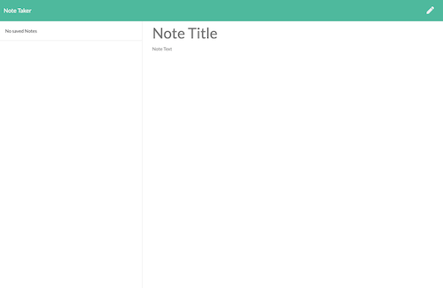

# 11_note_taker

## Description

This is an application that can be used to write, save, and delete notes. This application uses an express backend to save and retrieve data from a JSON file.

-----

## Table of Contents

* [Installation](#installation)
* [Usage](#usage)
* [Images](#images)
* [License](#license)
* [Contributing](#contributing)
* [Tests](#tests)
* [Questions](#questions)

-----

## Installation

This application has been deployed to Heroku, and it can be accessed by clicking the following link:

[tmk-note-taker](https://tmk-note-taker.herokuapp.com/)

-----

## Usage

1. Click on "Get Started"
1. Add a title for your note.
1. Add text for the note body.
1. Hit the save button to save the note in the list to the left.
1. Select notes in the list on the left to view at any time.
1. Hit the trash button on any note to delete it from the list.

-----

## Images

The following images are examples of the screens and functionality of this application.

-----

## License

This project does not have a license.

-----

## Contributing

This project is a homework assignment, and it has no need for additional contributions.

-----

## Tests

There are no tests built for this project.

-----

## Questions

If you have any questions about this project, please free to contact me through my [Github profile](https://github.com/timothykemp) or via [email](mailto:timothymichaelkemp@gmail.com).
